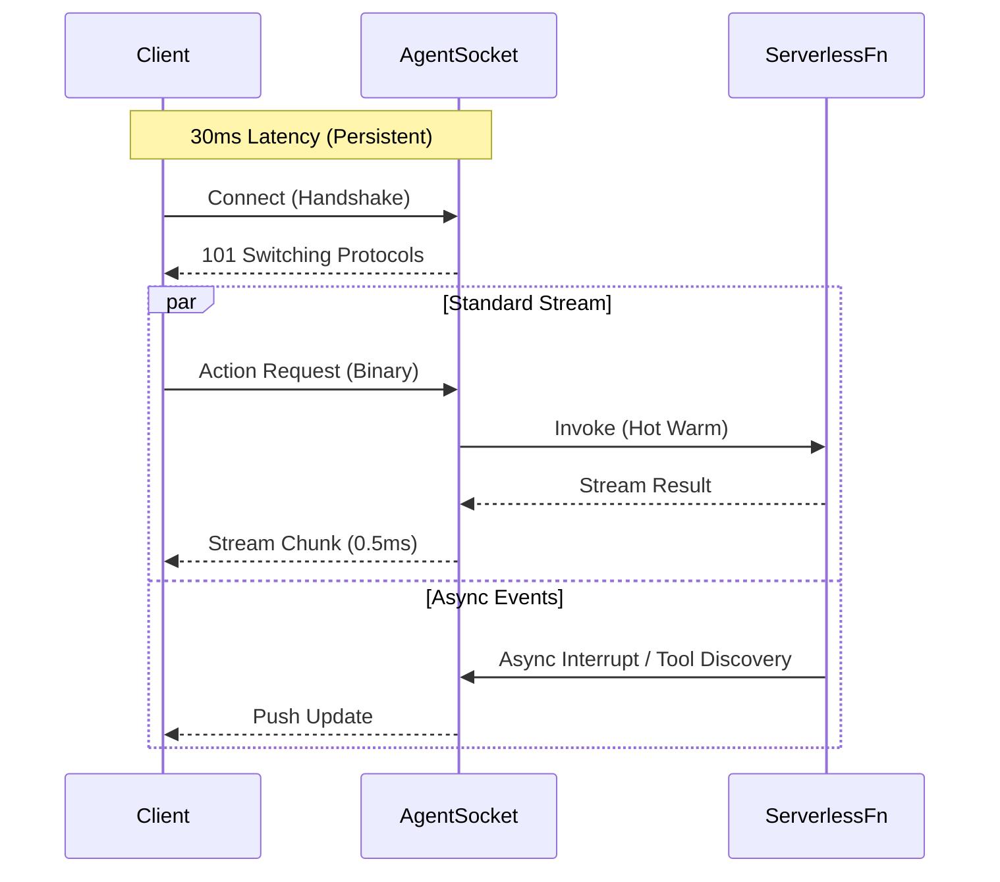

# Agent Socket
### Stateful Agents on Stateless Infrastructure.

**Agent Socket** is a Serverless-Native, WebSocket-first wire protocol engineered from first principles for modern AI Agents. It is designed as a high-performance, bidirectional alternative to HTTP-based standards (like MCP).

---

## ⚡ The Problem: Standardizing Technical Debt
The industry is currently standardizing on **HTTP + SSE** for agentic systems (via MCP). This forces 2025 AI agents to operate with 2015 constraints:
* **High Latency:** Handshake overhead per interaction.
* **Unidirectional:** Servers cannot interrupt or steer the client effectively.
* **Stateless:** Incompatible with complex, multi-turn agent context without external DB bloat.

## 🚀 The Solution: Agent Socket
**Agent Socket** treats the connection as a persistent, stateful stream, even when running on ephemeral infrastructure (Lambda/Edge).

## ⚔️ Agent Socket vs. MCP (HTTP)

| Feature | Agent Socket (This Protocol) | MCP (HTTP + SSE) |
| :--- | :--- | :--- |
| **Transport** | **WebSockets (Binary)** | HTTP (Text/JSON) |
| **Latency** | **< 30ms** (Persistent) | 100ms+ (Per Request) |
| **Communication** | **True Full-Duplex** | Request / Response |
| **Serverless** | **Native** (Zero Cold Start) | High Cold Start Penalty |
| **Discovery** | **Async / Just-in-Time** | Upfront / Static |
| **Overhead** | **Minimal** (Binary frames) | Heavy (HTTP Headers) |

---

## ✨ Core Features

### 1. True Full-Duplex Communication
Unlike HTTP, where the client must ask before the server speaks, Agent Socket allows agents to push updates, request clarification, or discover tools asynchronously without a new request cycle.

### 2. Serverless-Native Connection Pooling
Designed for AWS Lambda, Cloudflare Workers, and Azure Functions. The protocol handles connection state management outside the function logic, allowing ephemeral compute to behave like a stateful server.

### 3. Binary Efficiency
By eliminating repetitive HTTP headers and using optimized binary framing, Agent Socket reduces network bandwidth usage by up to **50%** compared to verbose JSON-over-HTTP protocols.

---

## 🗺️ Roadmap

- [x] **Phase 1:** Architecture & Theory Validation (Completed Dec 2025)
- [ ] **Phase 2:** Formal Specification White Paper (Q1 2026)
- [ ] **Phase 3:** Reference Implementation (TypeScript/Rust/Python/Node.js) (Q1 2026)
- [ ] **Phase 4:** Python SDK, Rust SDK & Benchmarks

---

## 👤 Author & Philosophy
**Architected by Kunal Gawde**

> *"We shouldn't standardize on technical debt. Existing protocols assume persistent servers; Agent Socket assumes the future is serverless."*

---

## 📄 License
Copyright © 2025 Kunal Gawde. All Rights Reserved.

Licensed under the **Apache 2.0 License** (the "License"); you may not use this file except in compliance with the License. You may obtain a copy of the License at

    http://www.apache.org/licenses/LICENSE-2.0

Unless required by applicable law or agreed to in writing, software distributed under the License is distributed on an "AS IS" BASIS, WITHOUT WARRANTIES OR CONDITIONS OF ANY KIND, either express or implied. See the License for the specific language governing permissions and limitations under the License.
